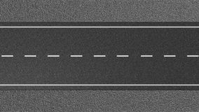
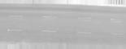
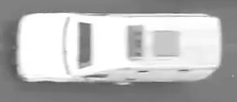
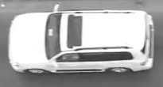

# VehicleDetector
This Repo is to detect the objects i-e  (cars, bike, trucks etc) using both machine learning and open-cv

Liblaries used (uptil now)
opencv-python
numpy
matplotlib

<h3> This Repository in future will contain two methods to detect Objects i-e vehicles  from the images </h3>
<h5> 1: Through Opencv </h5>
<h5> 2: Through Keras </h5>

<h4> Opencv </h4> 
<b> Creating Custom HarCascade Classifier </b>
This in section I'll try to create a Custom HarCascade Classifier for my images, where the images be images has been divided into 
<b> negative (n) </b> and <b> positive (p) </n> folder, where the POSITIVE folder contains only the croped images of the objects
and the NEGATIVE folder will contains images except the images of objects in it.. 

<h6> POSITIVE IMAGES </h6>

<h6> POSITIVE IMAGES </h6>

